# PRD: Nền tảng Thuyết minh Đa ngôn ngữ Phố Ẩm thực Vĩnh Khánh (Hệ thống hiện tại)

| Trường | Nội dung |
|---|---|
| Tên dự án | VinhKhanh Food Street Platform |
| Phiên bản | 2.0 - System Baseline (Apr 2026) |
| Trạng thái | Draft for implementation alignment |
| Phạm vi hệ thống | Mobile App (.NET MAUI) + Backend API (ASP.NET Core) + Admin Portal (ASP.NET MVC) + Owner Portal (Razor Pages) |
| Địa bàn | Phố Vĩnh Khánh, Quận 4, TP.HCM |
| Ngôn ngữ | vi mặc định + đa ngôn ngữ theo content/audio và luồng localization on-demand |
| Môi trường dữ liệu | SQLite (dev) / SQL Server (prod) qua EF Core |

---

## 1. TL;DR
Hệ thống VinhKhanh là nền tảng thuyết minh địa điểm ẩm thực theo vị trí và QR cho du khách, đồng thời có quy trình vận hành đầy đủ cho admin và chủ quán. Mobile app MAUI tự động phát narration theo geofence, quét QR để nghe nhanh, đồng bộ dữ liệu thời gian thực qua SignalR, hỗ trợ offline map/audio cục bộ. Backend quản lý POI/content/audio/analytics và luồng kiểm duyệt owner. Admin Portal giám sát vận hành, publish/unpublish POI, duyệt yêu cầu từ owner, theo dõi heatmap/engagement. Owner Portal cho phép đăng ký tài khoản, gửi yêu cầu tạo/sửa/xóa POI, quản lý audio và bản dịch theo cơ chế chờ duyệt.

## 2. Goals
### Business Goals
- Chuẩn hóa vận hành nội dung địa điểm trên một nền tảng tập trung (POI, content, audio, analytics).
- Đảm bảo trải nghiệm nghe thuyết minh nhanh tại điểm đến (geofence hoặc QR).
- Kiểm soát chất lượng nội dung qua workflow owner submit -> admin approve trước khi public.
- Tăng khả năng mở rộng đa ngôn ngữ với pipeline AI translation + localization warmup/on-demand.

### User Goals
- Du khách mở app/map và nghe nội dung tự động khi đến gần POI.
- Du khách có thể quét QR công khai hoặc QR trong app để nghe ngay theo ngôn ngữ chọn.
- Chủ quán có thể tự quản lý nội dung, audio, bản dịch qua owner portal.
- Admin có dashboard theo dõi hiệu quả vận hành và hành vi sử dụng thực tế.

### Non-Goals
- Không xử lý thanh toán hoặc đặt món online trong phiên bản hiện tại.
- Không xây social feed hoặc đánh giá cộng đồng từ người dùng cuối.
- Không mở tự do publish nội dung từ owner mà không qua duyệt.

## 3. Personas & User Stories
**Persona 1 - Du khách**
- Là du khách, tôi muốn app tự phát thuyết minh khi đi vào bán kính POI.
- Là du khách, tôi muốn quét QR để nghe nội dung ngay cả khi GPS không ổn định.
- Là du khách, tôi muốn đổi ngôn ngữ nghe và có fallback khi thiếu audio gốc.

**Persona 2 - Admin hệ thống**
- Là admin, tôi muốn quản lý POI tập trung và bật/tắt publish nhanh theo trạng thái.
- Là admin, tôi muốn duyệt yêu cầu owner (create/update/delete/audio/translation) trước khi áp dụng.
- Là admin, tôi muốn theo dõi top POI, heatmap, active users, engagement theo thời gian.

**Persona 3 - Chủ quán (Owner)**
- Là owner, tôi muốn đăng ký tài khoản và chờ admin duyệt để vào hệ thống.
- Là owner, tôi muốn gửi yêu cầu chỉnh sửa/xóa POI hiện có mà không phá dữ liệu đang chạy.
- Là owner, tôi muốn cập nhật audio/bản dịch để tăng trải nghiệm du khách.

## 4. Functional Requirements
- **FR-01 Authentication & Authorization (High):** JWT/cookie-based luồng đăng nhập; role + permission cho admin/owner.
- **FR-02 POI Management (High):** CRUD POI, trạng thái publish, bulk action, owner ownership.
- **FR-03 Geofencing & Narration (High):** Poll GPS, trigger POI theo bán kính, autoplay narration.
- **FR-04 QR Experience (High):** QR mobile scan + web public QR (`/qr/{id}` -> `/listen/{id}`), track analytics.
- **FR-05 Content & Localization (High):** Quản lý content theo ngôn ngữ, fallback vi/en, warmup/on-demand localization.
- **FR-06 Audio Pipeline (High):** Upload audio, TTS generation, đa tầng fallback playback trên mobile.
- **FR-07 Owner Moderation Workflow (High):** Owner submit create/update/delete/audio/translation, admin review/approve/reject.
- **FR-08 Analytics & Observability (Medium):** Track events, heatmap, topPois, engagement, live stats, QR metrics.
- **FR-09 Realtime Sync (Medium):** SignalR hub phát sự kiện POI thay đổi tới client.
- **FR-10 Offline Support (Medium):** map runtime config + offline manifest, lưu cục bộ dữ liệu cần thiết.

## 5. Technical Considerations
- **Backend API:** ASP.NET Core + EF Core, SQLite dev / SQL Server prod, static files cho media.
- **Mobile App:** .NET MAUI + Maps + ZXing QR + native TTS + audio queue/provider chain.
- **Admin Portal:** ASP.NET MVC, gọi API qua `HttpClient` + API key.
- **Owner Portal:** Razor Pages, dựa trên cookie `owner_userid`, gửi request tới API moderation.
- **Realtime:** SignalR hub `/sync` cho đồng bộ POI.
- **AI & Localization:** `api/ai/translate-content`, `api/localizations/*` (prepare-hotset, on-demand, warmup).
- **Media:** Audio/ảnh upload và cache TTS phục vụ đa ngôn ngữ.

## 6. Business Rules
| Rule | Diễn giải |
|---|---|
| BR-01 | POI chỉ hiển thị public khi `IsPublished = true`. |
| BR-02 | Owner không chỉnh trực tiếp dữ liệu production, chỉ gửi request chờ admin duyệt. |
| BR-03 | Khi owner gửi yêu cầu update, POI có thể tạm unpublish cho đến khi duyệt xong. |
| BR-04 | Geofence trigger ưu tiên phát narration theo ngôn ngữ hiện tại, fallback content/audio khi thiếu dữ liệu. |
| BR-05 | QR scan (mobile/web) phải ghi log analytics event (`qr_scan`, `tts_play`, `poi_enter`...). |
| BR-06 | Localization on-demand có kiểm tra nội dung nhạy cảm theo keyword policy trước khi sinh bản địa hóa. |
| BR-07 | Audio playback áp dụng fallback đa tầng để giảm tỉ lệ fail phát tiếng. |
| BR-08 | Admin có quyền publish/unpublish đơn lẻ và hàng loạt để phản ứng nhanh vận hành. |

---

## 7. Data Schema (Logical)
- **`PointsOfInterest`**: thông tin POI (tọa độ, radius, priority, ownerId, isPublished, qrCode, imageUrl...).
- **`PointContents`**: nội dung theo ngôn ngữ (title/subtitle/description/address/price/opening hours/audioUrl...).
- **`AudioFiles`**: metadata audio theo POI + language.
- **`TraceLogs`**: nhật ký hành vi và telemetry.
- **`Users`**: tài khoản và quyền (admin/owner, permissions, verified state).
- **`OwnerRegistrations`**: hồ sơ đăng ký owner chờ duyệt.
- **`PoiRegistrations`**: yêu cầu create/update/delete từ owner chờ admin xử lý.
- **`LocalizationJobLogs`**: log pipeline localizations warmup/on-demand.
- **`AiUsageLogs`**: log sử dụng tác vụ AI.
- **`Tours`**: mô hình tour tuyến (nếu bật trong vận hành).

---

## 8. Sơ đồ Kiến trúc Cấu trúc Hệ thống (System Architecture Diagram)
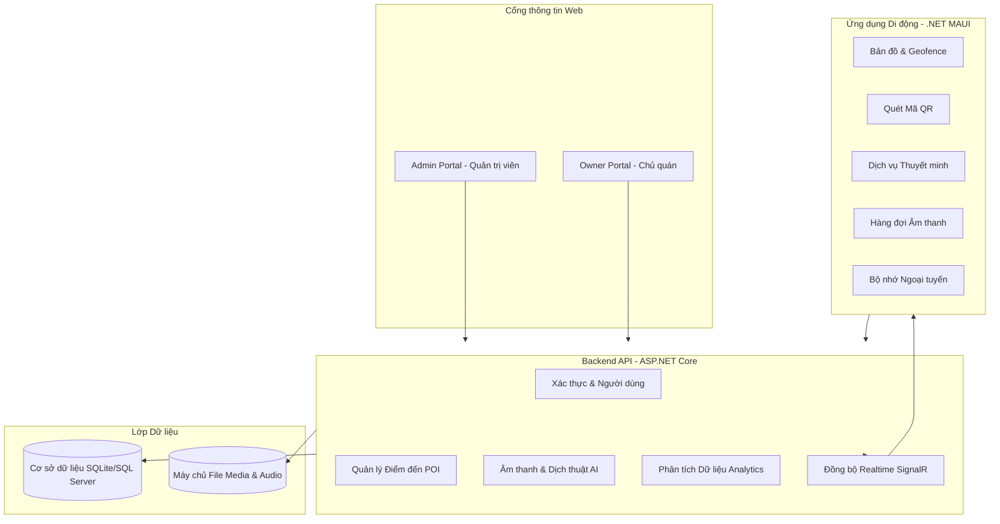

---

## 9. Sơ đồ Tuần tự Kỹ thuật (Sequence Diagrams)

### 9.1 Sơ đồ tuần tự - Đăng ký Chủ quán và Đăng nhập
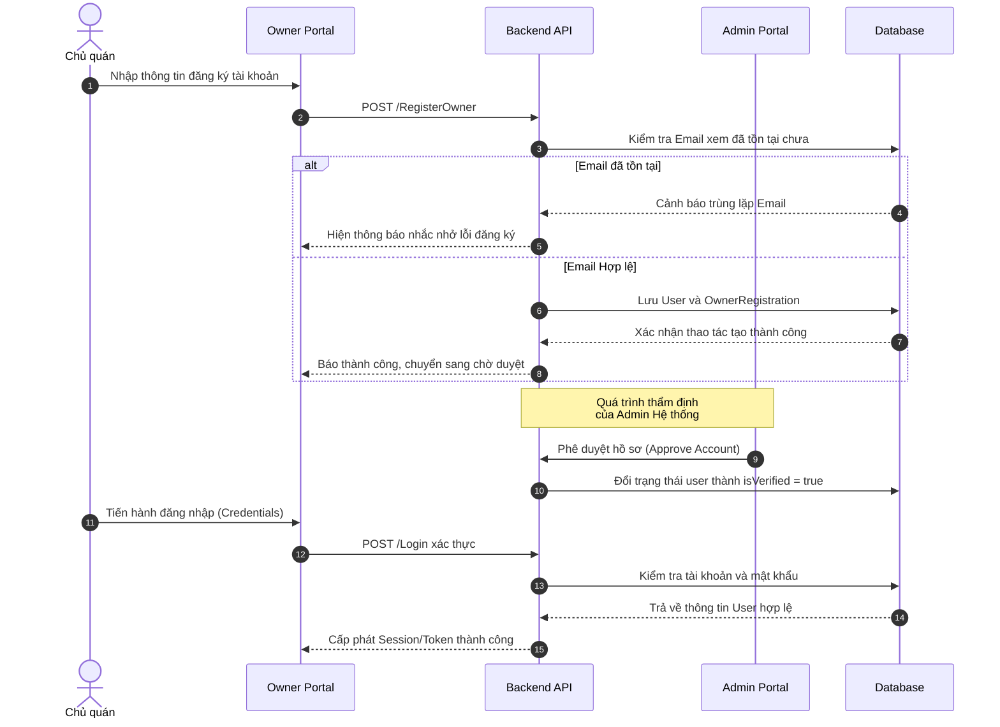

### 9.2 Sơ đồ tuần tự - Geofence và Tự động phát thuyết minh
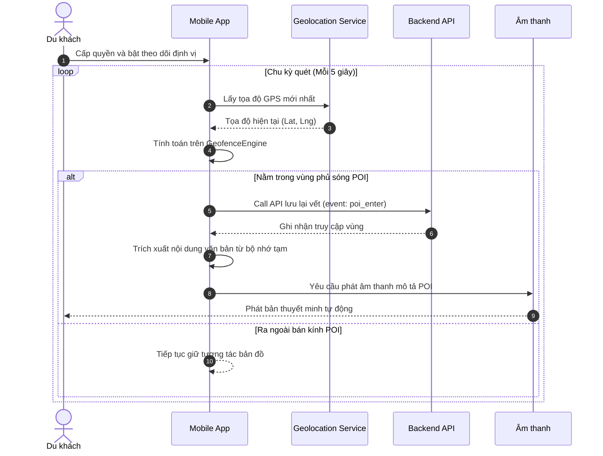

### 9.3 Sơ đồ tuần tự - Quét mã QR trên Mobile App
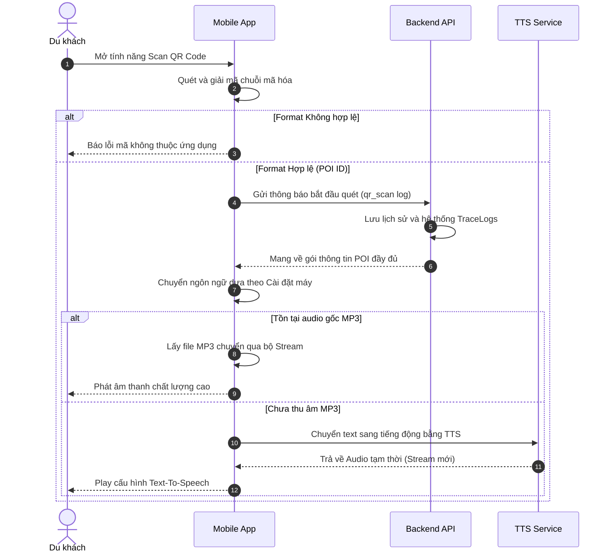

### 9.4 Sơ đồ tuần tự - Quản lý Điểm đến (POI) từ Admin Portal
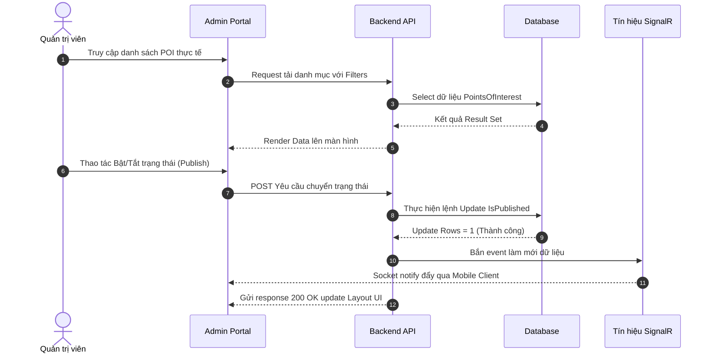

### 9.5 Sơ đồ tuần tự - Chủ quán (Owner) gửi yêu cầu quản lý POI
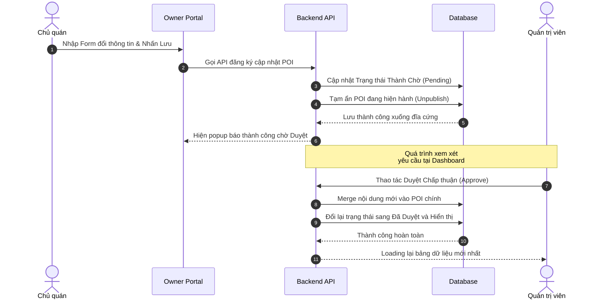

### 9.6 Sơ đồ tuần tự - Quy trình xử lý và dự phòng Âm thanh
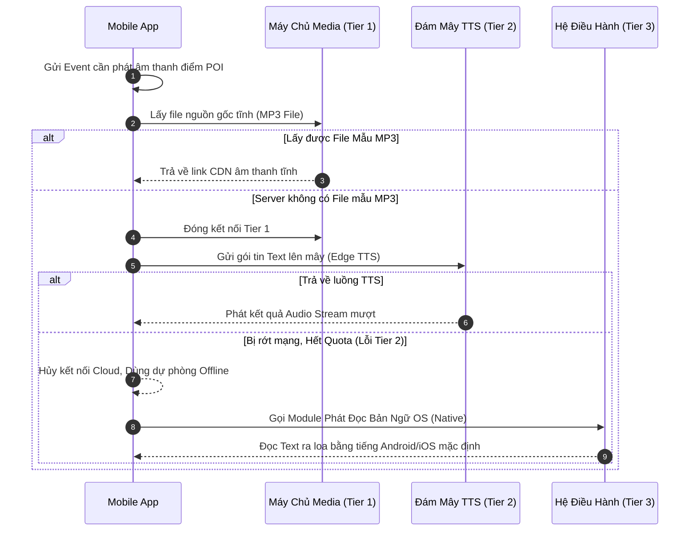

### 9.7 Sơ đồ tuần tự - Dịch thuật AI và Bản địa hóa
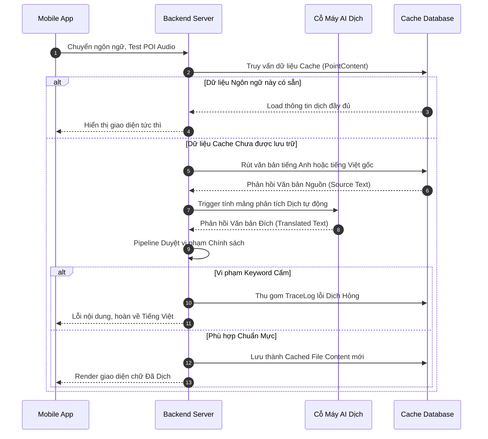

### 9.8 Sơ đồ tuần tự - Phân tích Dữ liệu Analytics
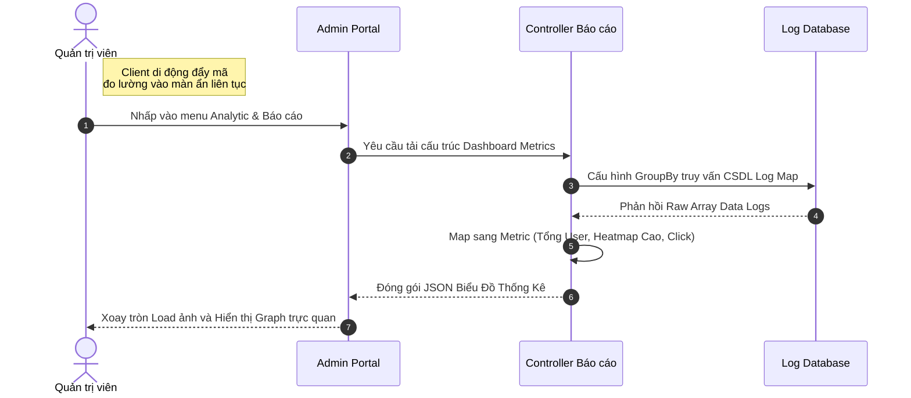

---

## 10. Activity Diagrams Theo Chức Năng

### 10.1 Activity - Đăng ký Owner và đăng nhập
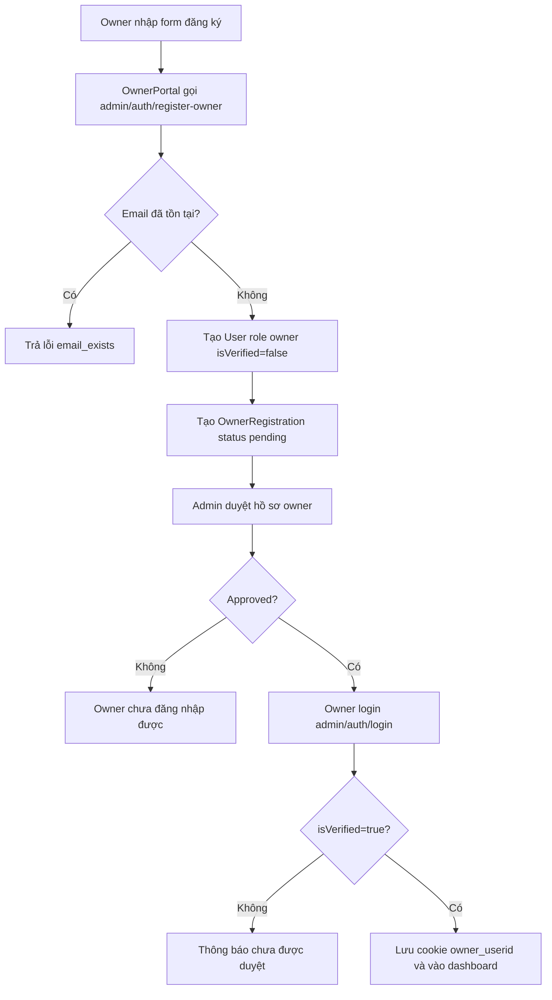

### 10.2 Activity - Geofence và tự động phát thuyết minh
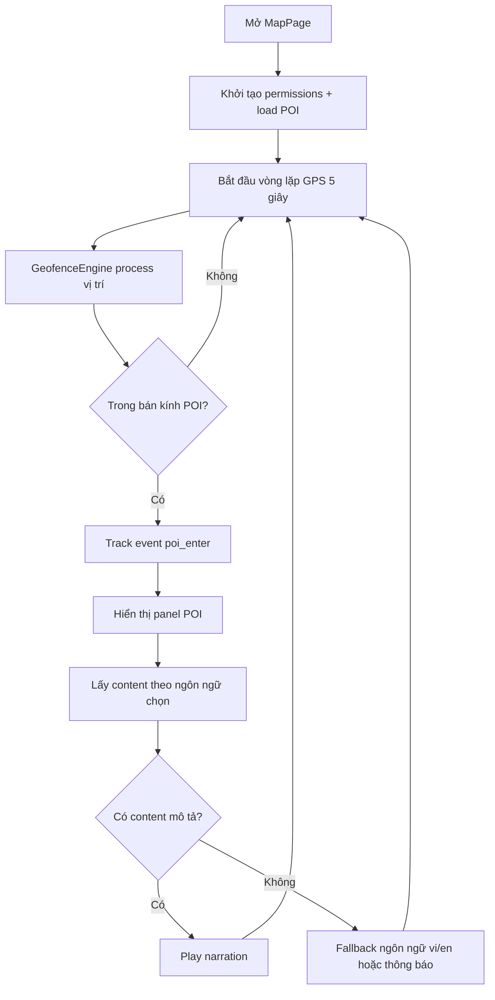

### 10.3 Activity - Quét QR trên mobile app
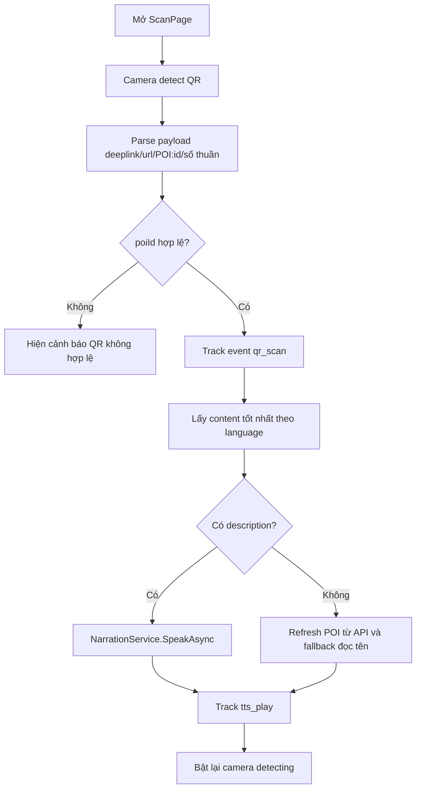

### 10.4 Activity - Quản lý POI từ Admin Portal
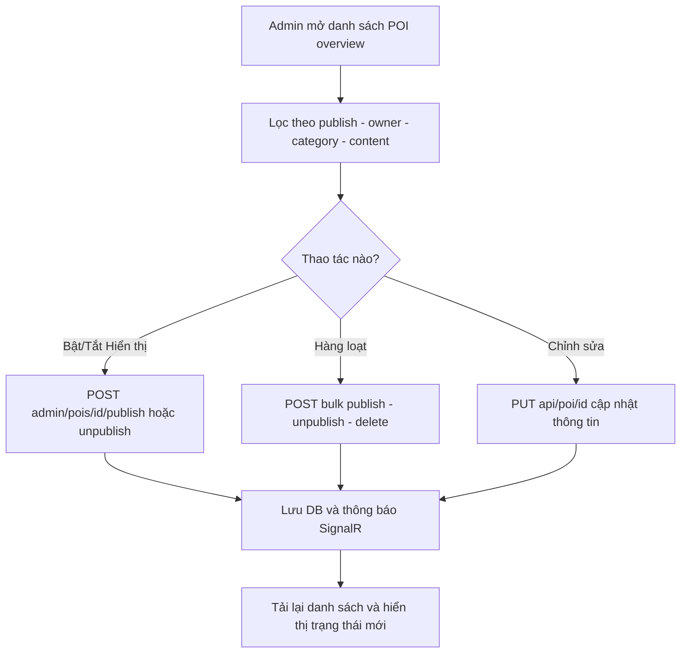

### 10.5 Activity - Owner gửi yêu cầu tạo/sửa/xóa POI
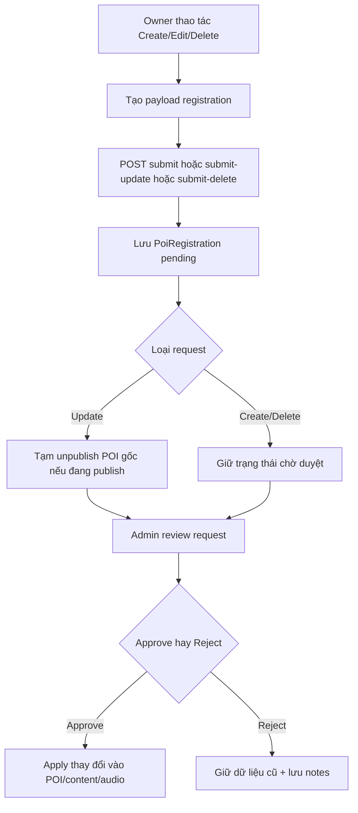

### 10.6 Activity - Audio pipeline đa tầng
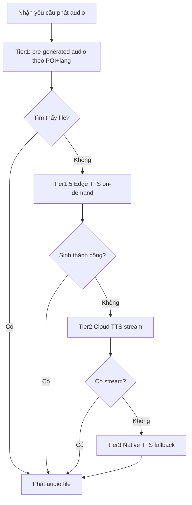

### 10.7 Activity - Localization và AI translation
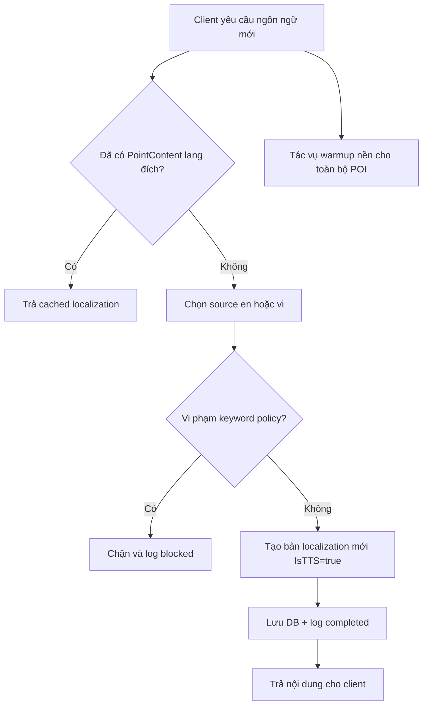

### 10.8 Activity - Analytics và dashboard
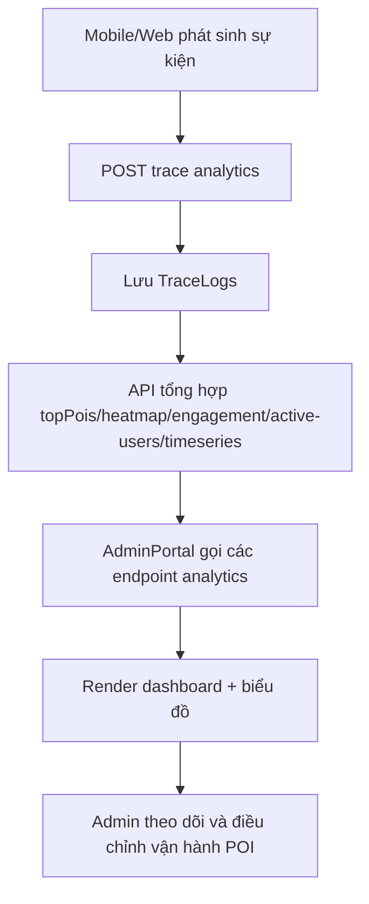

---

## 11. API Surface (Nhóm endpoint chính)
- **Auth & User:** `admin/auth/*`, `admin/users/*`, `owneradmin/*`.
- **POI & Content:** `api/poi/*`, `api/content/*`, `admin/pois/*`, `owner/pois/*`.
- **Moderation:** `api/poiregistration/*`, `api/ownerregistration/*`.
- **Audio & Localization:** `api/audio/*`, `api/localizations/*`, `api/ai/*`.
- **Public Experience:** `/qr/{id}`, `/listen/{id}`, `/listen/{id}/generate-tts`.
- **Analytics:** `api/analytics/*`, `api/tracelog*` (qua portal/controller liên quan).
- **Maps/Health/Sync:** `api/maps/*`, `/health`, `/sync` (SignalR).

## 12. NFR & Acceptance Criteria
### Performance
- Narration được kích hoạt trong trải nghiệm thực tế ở mức chấp nhận được sau trigger geofence/QR.
- Dashboard analytics tải được tập dữ liệu lớn ở mức top/limit hợp lý.

### Reliability
- Fallback audio phải hoạt động khi thiếu file pre-generated.
- Public QR listen page không crash khi thiếu dữ liệu content/audio.

### Security
- API admin cần token hoặc API key hợp lệ.
- Owner chỉ thao tác trên POI thuộc quyền sở hữu.
- Dữ liệu nhạy cảm owner registration được mã hóa ở tầng lưu trữ.

### Operability
- Có health endpoint để kiểm tra readiness.
- Có log job cho localization và AI usage phục vụ debug/vận hành.

---

## 13. Open Issues / Improvement Backlog
- Chuẩn hóa cơ chế auth giữa JWT, cookie, API key để giảm phân mảnh.
- Bổ sung policy/permission matrix chính thức theo role.
- Chuẩn hóa event taxonomy analytics (tên event, source, schema).
- Tăng test coverage cho luồng moderation owner và public QR listen.
- Bổ sung SLA kỹ thuật cụ thể (P95 response time, error budget, retry policy).

