# PART 1: SD-01 → SD-07
# Copy từng block @startuml...@enduml vào https://www.plantuml.com/plantuml/uml

---
## SD-01 — Đăng ký Owner & Đăng nhập
**Mô tả:** Owner đăng ký trên OwnerPortal (email, password, tên quán, địa chỉ, CCCD) → API tạo User(isVerified=false) + OwnerRegistration(pending) → SignalR báo Admin → Admin duyệt → Owner đăng nhập → JWT → cookie → OwnerDashboard.

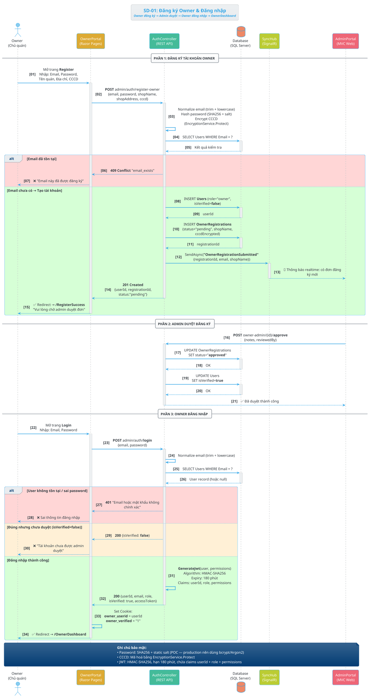

### Activity Diagram — SD-01

```plantuml
@startuml SD01_Activity
skinparam defaultFontSize 14
skinparam shadowing false
skinparam ActivityBorderColor #333333
skinparam ActivityBackgroundColor #FFFFFF
skinparam ActivityFontColor #000000
skinparam ArrowColor #333333
skinparam DiamondBorderColor #333333
skinparam DiamondBackgroundColor #FFFFFF
skinparam DiamondFontColor #000000
skinparam PartitionBorderColor #666666
skinparam PartitionBackgroundColor #F8F8F8

title SD-01 Activity: Đăng ký Owner & Đăng nhập

start

partition "**ĐĂNG KÝ**" {
  :Owner mở /Register
  Nhập: Email, Password,
  Tên quán, Địa chỉ, CCCD;

  :POST admin/auth/register-owner
  Normalize email + Hash password
  + Encrypt CCCD;

  :SELECT Users WHERE Email = ?;

  if (Email đã tồn tại?) then (Có)
    :409 "email_exists"
    ----
    Hiển thị lỗi: Email đã đăng ký;
    stop
  else (Chưa có)
  endif

  :INSERT Users
  (role=owner, isVerified=false);

  :INSERT OwnerRegistrations
  (status=pending);

  :SignalR: SendAsync
  ("OwnerRegistrationSubmitted");

  :201 Created
  Redirect /RegisterSuccess
  "Chờ admin duyệt";
}

partition "**ADMIN DUYỆT**" {
  :Admin xem danh sách pending;

  if (Admin quyết định?) then (Từ chối)
    :UPDATE status=rejected;
    stop
  else (Duyệt)
  endif

  :POST owner-admin/{id}/approve;

  :UPDATE status=approved
  UPDATE isVerified=true;
}

partition "**ĐĂNG NHẬP**" {
  :Owner mở /Login
  Nhập: Email, Password;

  :POST admin/auth/login
  Normalize email;

  :SELECT Users WHERE Email = ?;

  if (Đúng email & password?) then (Sai)
    :401 Unauthorized;
    stop
  else (Đúng)
  endif

  if (isVerified = true?) then (false)
    :Chưa được admin duyệt;
    stop
  else (true)
  endif

  :GenerateJwt(user, permissions)
  HMAC-SHA256, 180 phút;

  :200 OK {userId, accessToken};

  :Set Cookie
  owner_userid, owner_verified;

  :Redirect /OwnerDashboard;
}

stop

@enduml
```

---
## SD-02 — Geofence & Tự động phát Narration
**Mô tả:** LocationPollingService chạy background mỗi 5-10s lấy GPS → GeofenceEngine tính khoảng cách → nếu vào vùng POI + chưa cooldown → trigger ShowPoiDetail + PlayNarration TTS qua AudioQueueService → MiniPlayer.

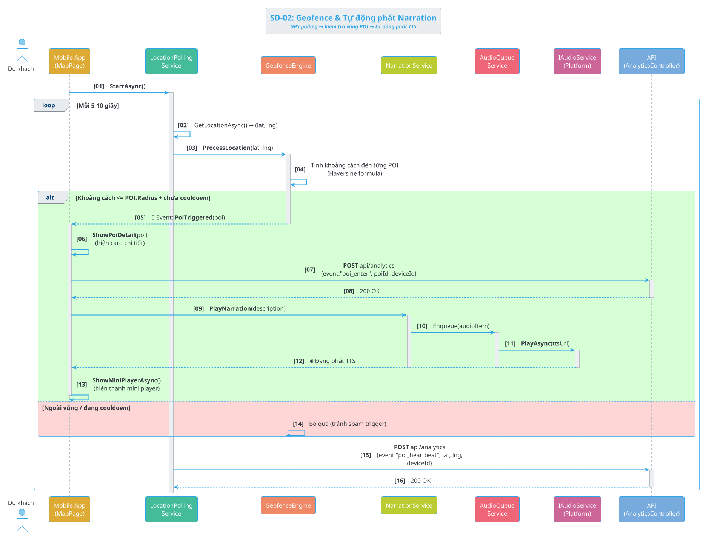

### Activity Diagram — SD-02

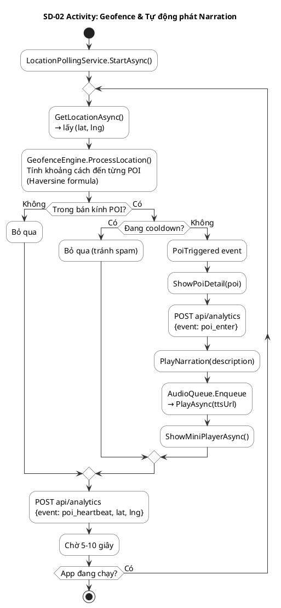

---
## SD-03 — Quét mã QR (Mobile)
**Mô tả:** Du khách mở camera quét QR → decode poiId → app tìm POI → ShowPoiDetail → gọi API lấy content + audio + reviews → track event qr_scan → auto phát TTS.

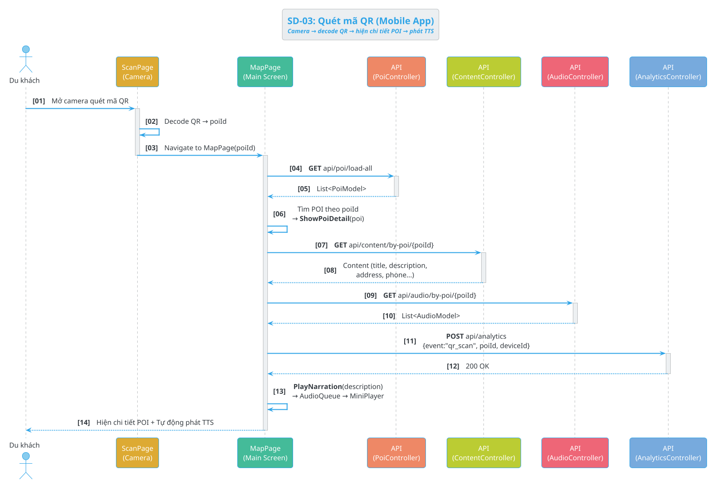

### Activity Diagram — SD-03

```plantuml
@startuml SD03_Activity
skinparam defaultFontSize 14
skinparam shadowing false
skinparam ActivityBorderColor #333333
skinparam ActivityBackgroundColor #FFFFFF
skinparam ArrowColor #333333
skinparam DiamondBorderColor #333333
skinparam DiamondBackgroundColor #FFFFFF
skinparam PartitionBorderColor #666666
skinparam PartitionBackgroundColor #F8F8F8

title SD-03 Activity: Quét mã QR (Mobile App)

start

:Mở camera quét QR;

:Decode QR → poiId;

:Navigate to MapPage(poiId);

:GET api/poi/load-all;

:Tìm POI theo poiId;

if (POI tồn tại?) then (Không)
  :Hiển thị lỗi;
  stop
else (Có)
endif

:ShowPoiDetail(poi);

:GET api/content/by-poi/{poiId}
→ title, description, address...;

:GET api/audio/by-poi/{poiId}
→ List<AudioModel>;

:POST api/analytics
{event: qr_scan, poiId};

:PlayNarration(description)
→ AudioQueue → MiniPlayer;

:Hiện chi tiết POI + phát TTS;

stop

@enduml
```

---
## SD-04 — Quét QR Web Public (/qr/{id})
**Mô tả:** Du khách quét QR bằng camera (không cần app) → browser mở /qr/{poiId} → PublicQrController redirect /listen/{id} → trang web hiện thông tin + auto-generate TTS nếu chưa cache → phát audio trên web.

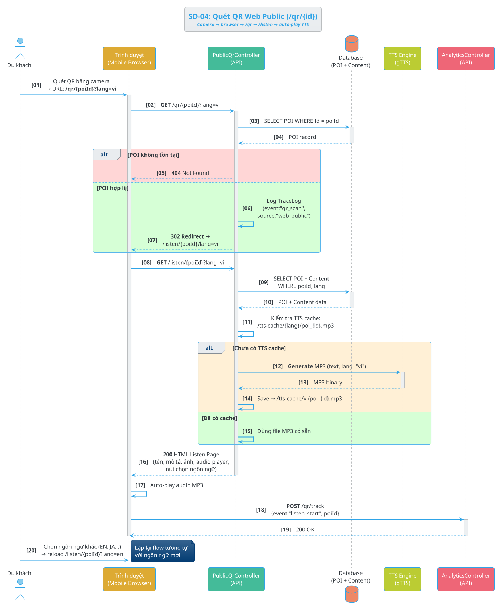

### Activity Diagram — SD-04

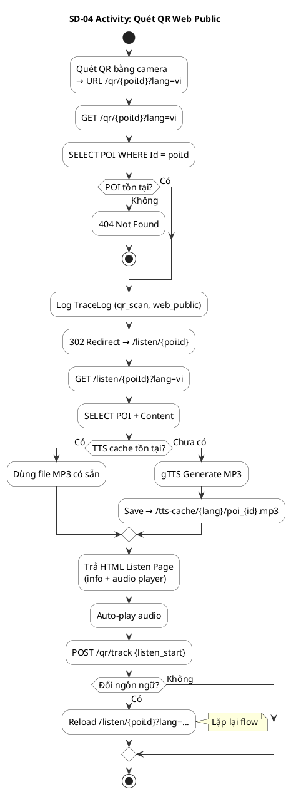

---
## SD-05 — Admin Quản lý POI (CRUD + Publish/Unpublish)
**Mô tả:** Admin xem danh sách POI → tạo/sửa/xóa trực tiếp → publish/unpublish → mỗi thao tác broadcast SignalR (PoiAdded/Updated/Deleted + RequestFullPoiSync) để Mobile cập nhật realtime.

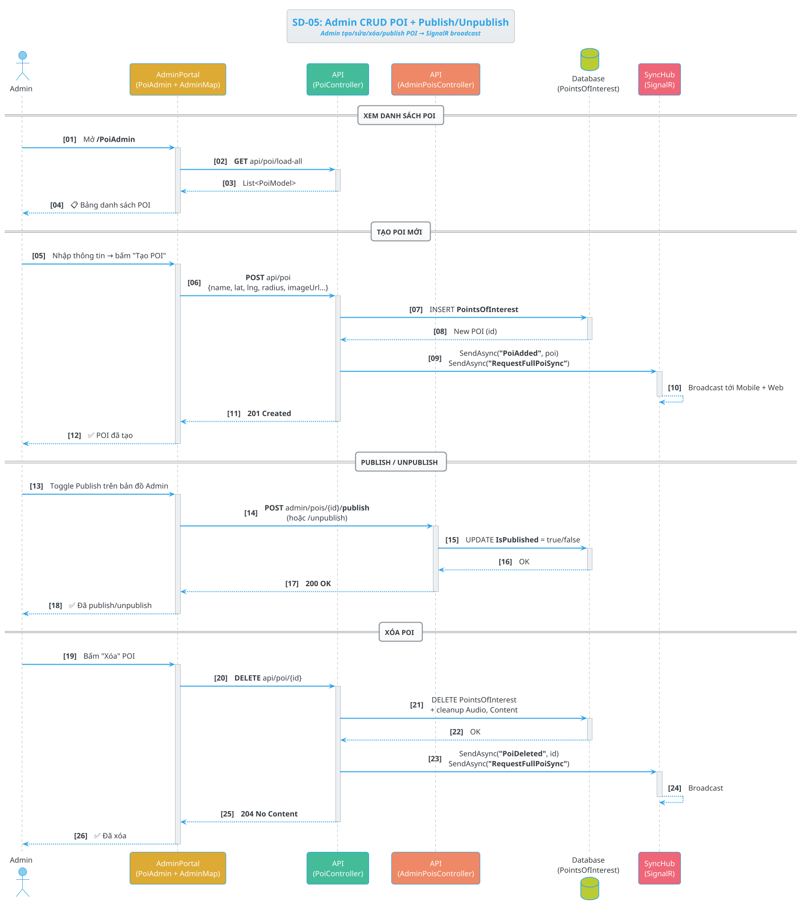

### Activity Diagram — SD-05

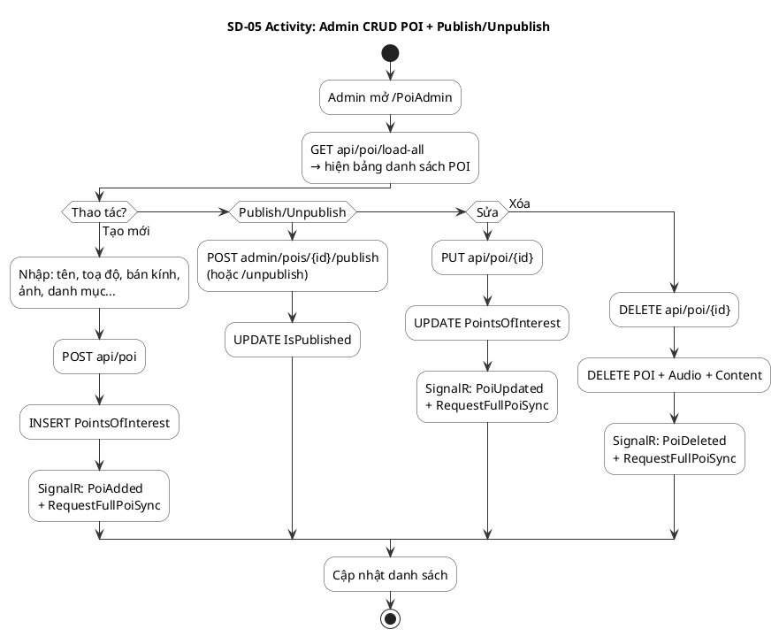

---
## SD-06 — Owner Submit Update/Delete → Admin Duyệt
**Mô tả:** Owner chỉnh sửa POI trên OwnerPortal → tạo PoiRegistration (requestType=update/delete, pending). Admin xem Pending → xem diff → approve (API cập nhật/xóa POI thật) hoặc reject.

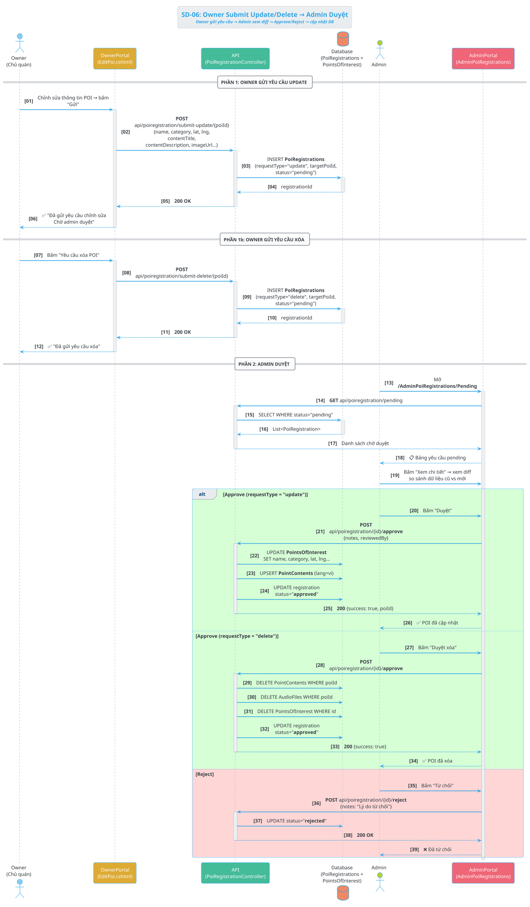

### Activity Diagram — SD-06

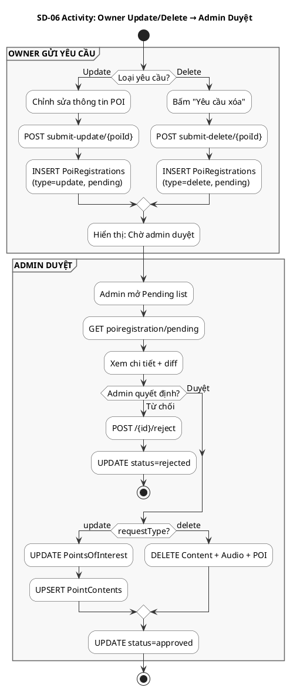

---
## SD-07 — Content CRUD + AI Auto-Translate + Rebuild
**Mô tả:** Admin tạo content tiếng Việt → bấm "Dịch tự động" → AiController gọi LLM dịch sang ngôn ngữ đích → lưu PointContents → SignalR broadcast. Rebuild All = dịch batch tất cả POI.

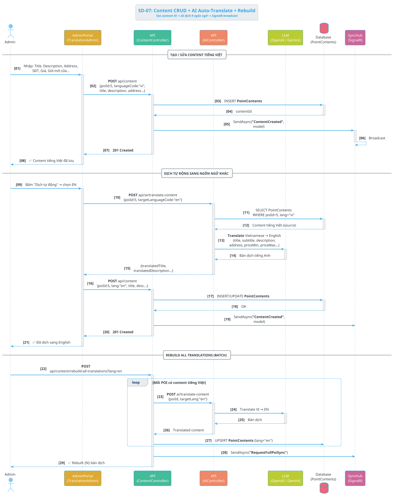

### Activity Diagram — SD-07

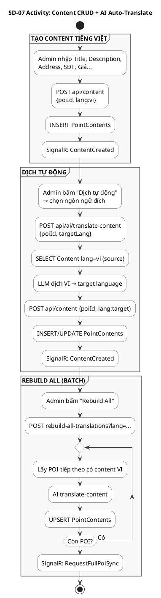
