# PART 2: SD-08 → SD-13
# Copy từng block @startuml...@enduml vào https://www.plantuml.com/plantuml/uml

---
## SD-08 — Analytics Dashboard (+ User đang Online)
**Mô tả:** Mobile gửi trace events → anti-spam MemoryCache → lưu TraceLogs → SignalR broadcast "TraceLogged". Admin Dashboard gọi GET summary (đếm user online = distinct deviceId trong 90s), topPois, heatmap, timeseries → hiện KPI cards + biểu đồ. JS auto-reload mỗi 20s.

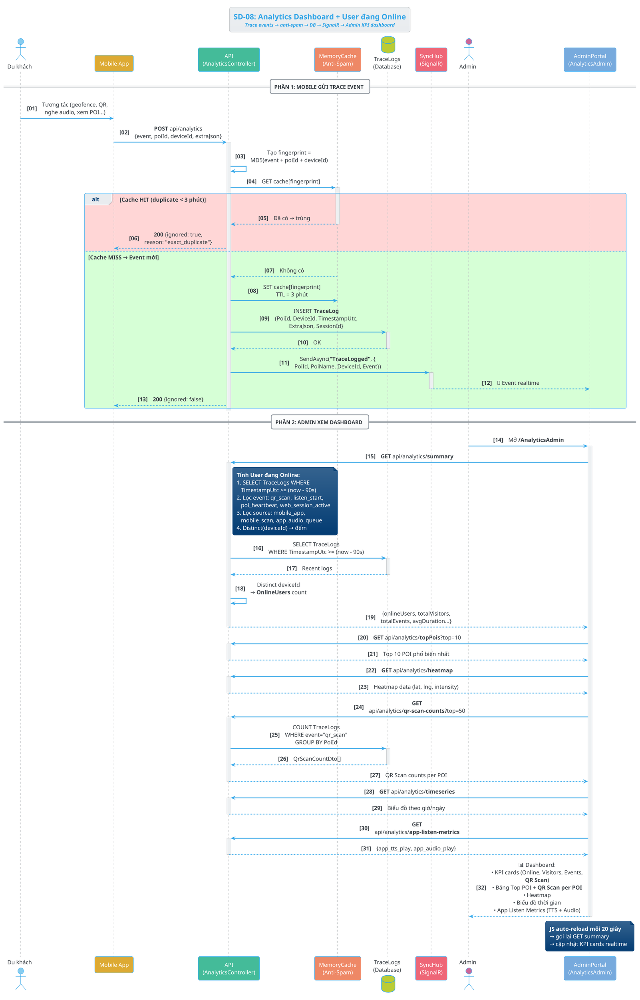

### Activity Diagram — SD-08

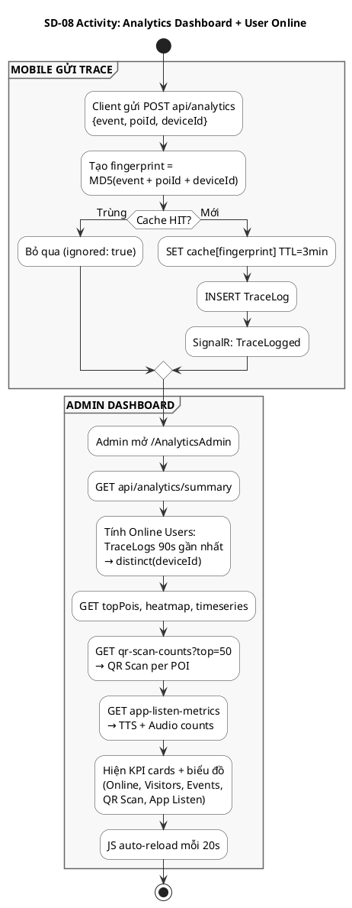

---
## SD-09 — Sinh & Cache TTS Audio
**Mô tả:** Khi cần phát TTS → kiểm tra cache /tts-cache/{lang}/poi_{id}.mp3. Chưa có → gọi gTTS sinh MP3 → lưu cache + DB → trả URL. Admin có thể Generate All Languages TTS cho 1 POI (batch 10 ngôn ngữ).

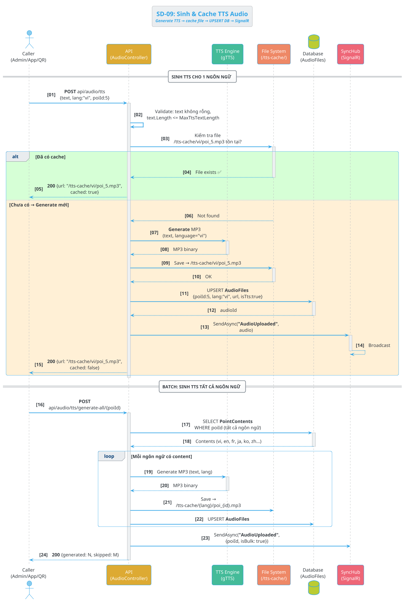

### Activity Diagram — SD-09

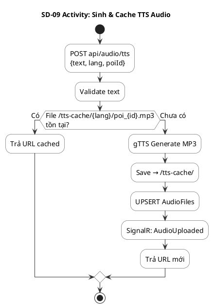

---
## SD-10 — Rebuild & Warmup Localization
**Mô tả:** prepare-hotset dịch sẵn cụm POI sang ngôn ngữ chỉ định. Warmup tải tất cả bản dịch vào MemoryCache. On-demand dịch 1 text cụ thể. Tất cả dùng AiController → LLM.

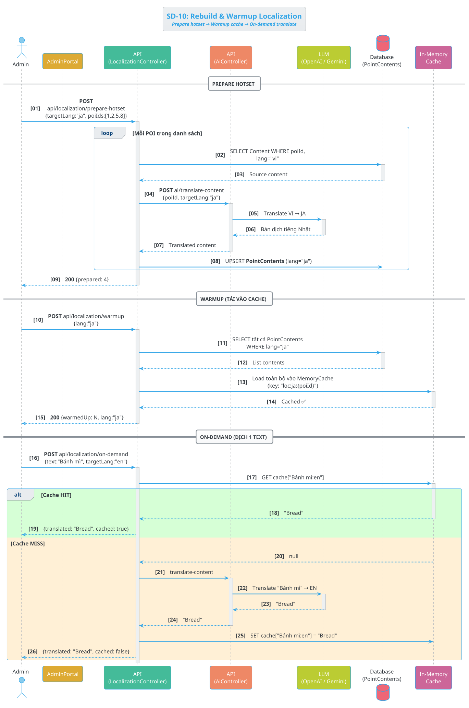

### Activity Diagram — SD-10

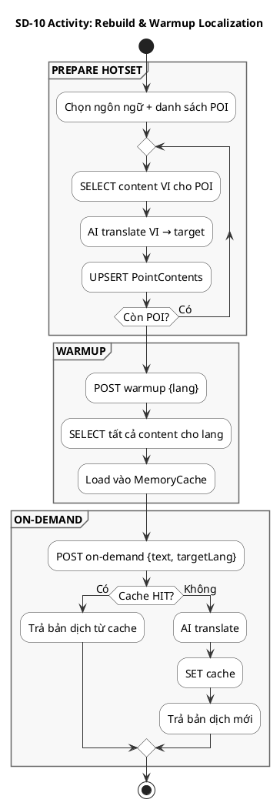

---
## SD-11 — Anti-Spam Trace Analytics
**Mô tả:** Mỗi event từ mobile/web qua bộ lọc anti-spam: tạo fingerprint MD5(event+poiId+deviceId), kiểm tra MemoryCache (TTL 3 phút). Trùng → bỏ. Mới → lưu TraceLog + broadcast SignalR "TraceLogged".

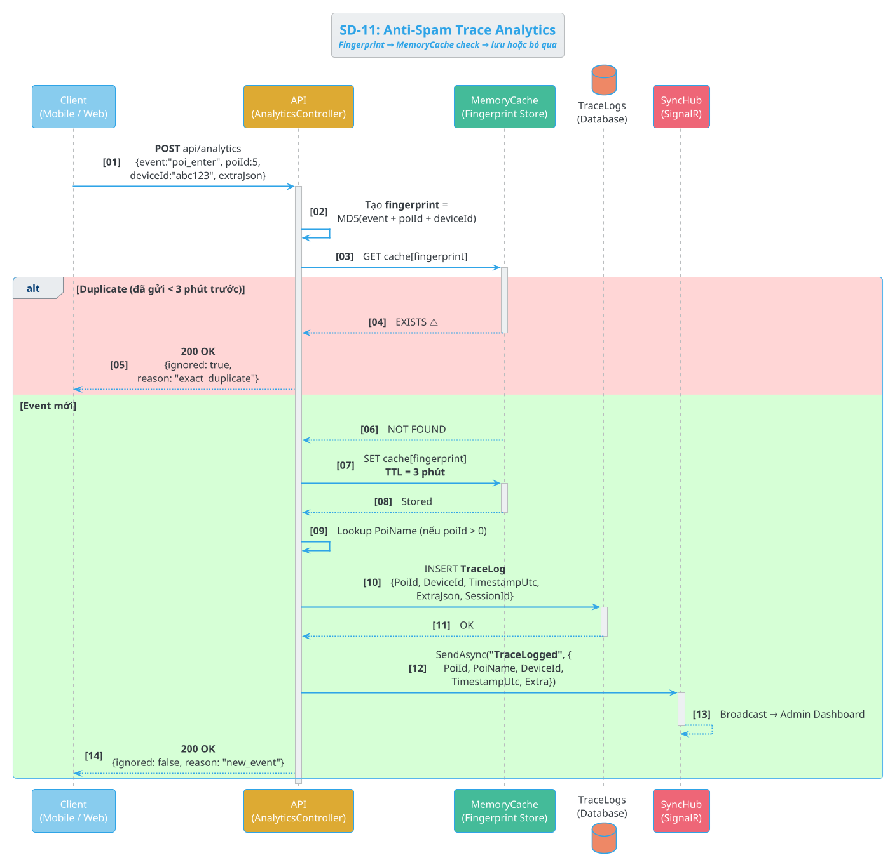

### Activity Diagram — SD-11

```plantuml
@startuml SD11_Activity
skinparam defaultFontSize 14
skinparam shadowing false
skinparam ActivityBorderColor #333333
skinparam ActivityBackgroundColor #FFFFFF
skinparam ArrowColor #333333
skinparam DiamondBorderColor #333333
skinparam DiamondBackgroundColor #FFFFFF
skinparam PartitionBorderColor #666666
skinparam PartitionBackgroundColor #F8F8F8

title SD-11 Activity: Anti-Spam Trace Analytics

start

:POST api/analytics
{event, poiId, deviceId};

:Tạo fingerprint =
MD5(event + poiId + deviceId);

:GET cache[fingerprint];

if (Cache HIT?) then (Trùng < 3 phút)
  :Trả {ignored: true,
  reason: exact_duplicate};
  stop
else (Mới)
endif

:SET cache[fingerprint]
TTL = 3 phút;

:Lookup PoiName;

:INSERT TraceLog;

:SignalR: TraceLogged;

:Trả {ignored: false};

stop

@enduml
```

---
## SD-12 — Đánh giá POI từ Du khách (Reviews)
**Mô tả:** Du khách gửi review (rating + comment) từ mobile → API lưu PoiReviews (IsHidden=false). App chỉ hiện review visible. Admin có thể ẩn/hiện/xóa review qua AdminPortal.

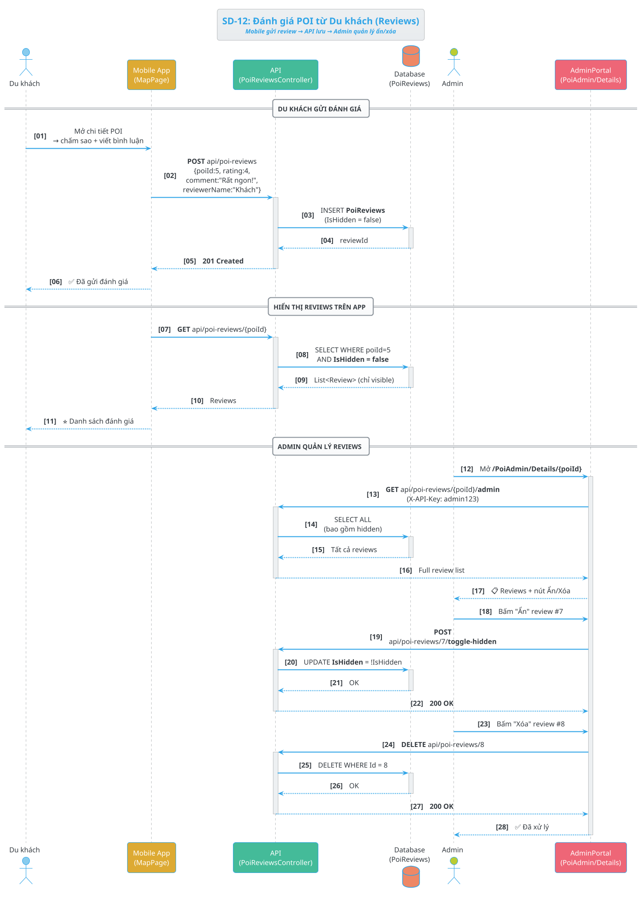

### Activity Diagram — SD-12

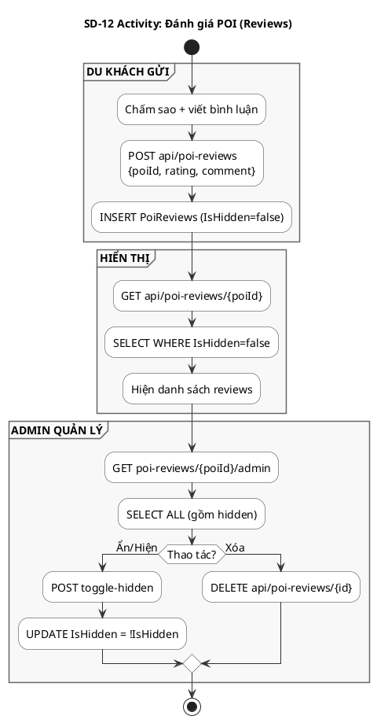

---
## SD-13 — Admin Quản lý User & Duyệt Owner
**Mô tả:** Admin xem danh sách owner đăng ký (pending) → duyệt (isVerified=true) hoặc từ chối (rejected). Admin cũng xem/toggle verified/cập nhật thông tin user.

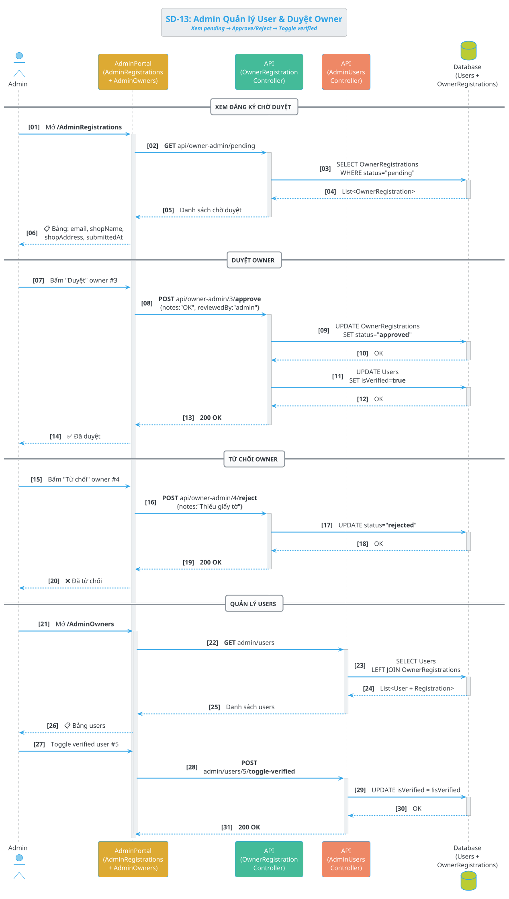

### Activity Diagram — SD-13

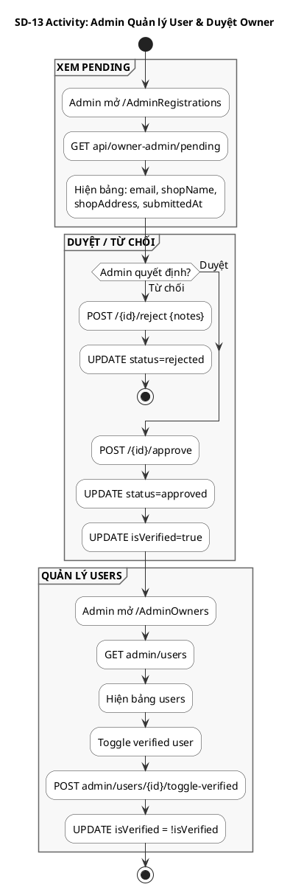
