# PART 3: SD-14 → SD-21 (Sửa tên + Mới hoàn toàn)
# Copy từng block @startuml...@enduml vào https://www.plantuml.com/plantuml/uml

---
## SD-14 (NEW) — Nghe Audio: TTS "Nghe ngay" + MP3 picker → Mini Player
**Mô tả:** Du khách bấm "Nghe ngay" → load TTS description → armed mode (popup mở, chưa phát) → bấm Play → AudioQueue → MiniPlayer. Hoặc bấm "Audio" → API load danh sách MP3 → chọn file → Enqueue → Play. Mini Player cho phép pause/resume/stop.

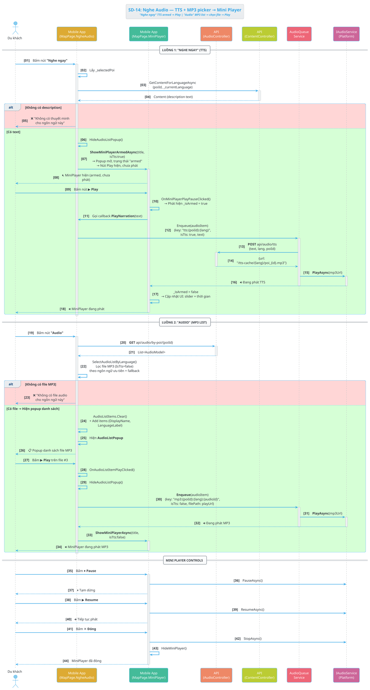

### Activity Diagram — SD-14

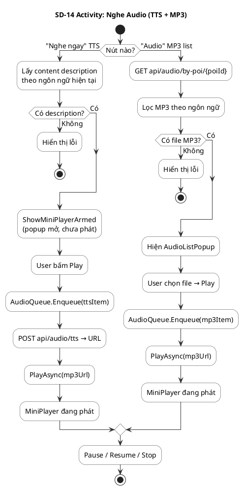

---
## SD-15 — Owner Upload Ảnh & Submit Tạo POI Mới (→ chờ duyệt)
**Mô tả:** Owner mở CreatePoi trên OwnerPortal → điền thông tin + upload ảnh → API upload file → tạo PoiRegistration (type=create, pending) → Owner chờ Admin duyệt (xem SD-18).

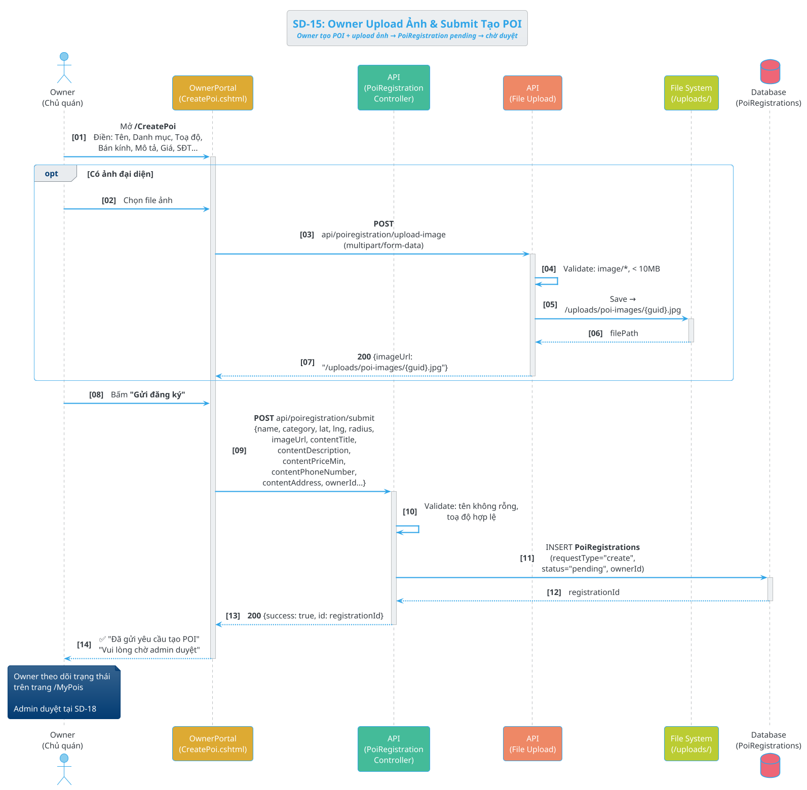

### Activity Diagram — SD-15

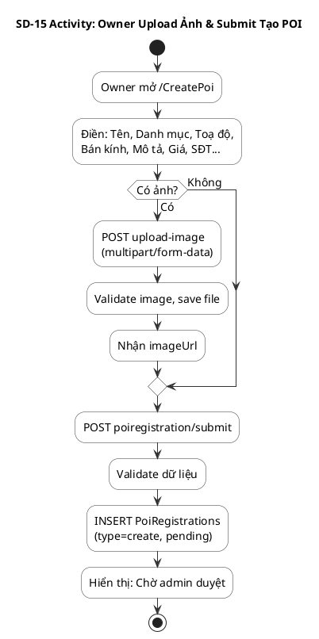

---
## SD-16 (NEW) — App khởi động → Load bản đồ POI
**Mô tả:** Du khách mở app → MapPage.OnAppearing() → load POI từ SQLite local → render pin lên bản đồ → kết nối SignalR → sync từ API nếu DB rỗng → khởi động GPS → hiện highlights.

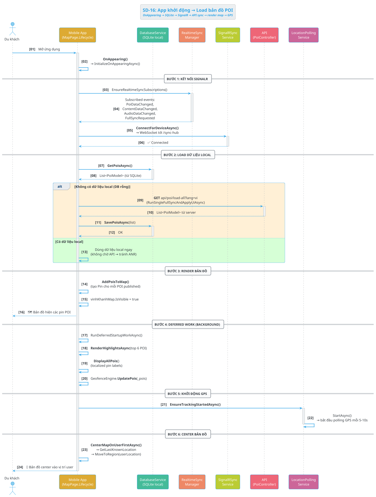

### Activity Diagram — SD-16

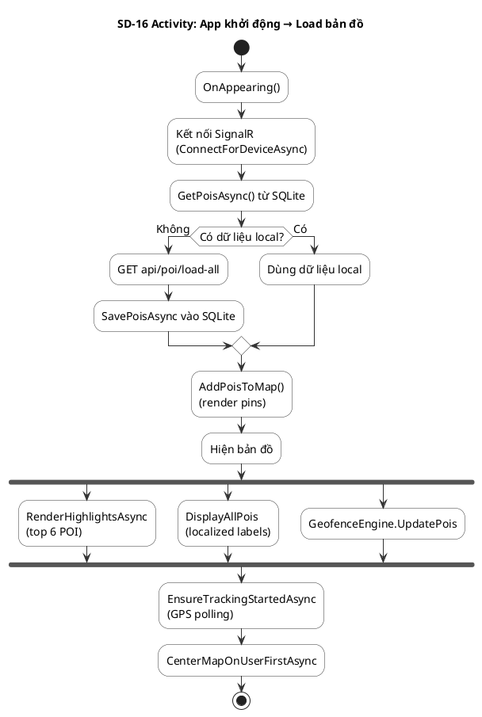

---
## SD-17 (NEW) — Bấm pin → Xem chi tiết POI + Đổi ngôn ngữ
**Mô tả:** Du khách bấm pin → ShowPoiDetail → load content local trước → hydrate từ API (content, audio, reviews) ở background → render card. Đổi ngôn ngữ → reload content cho cùng POI.

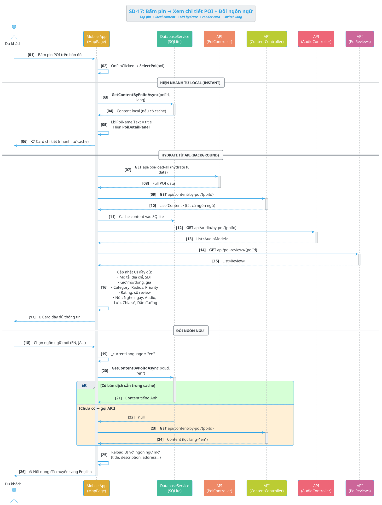

### Activity Diagram — SD-17

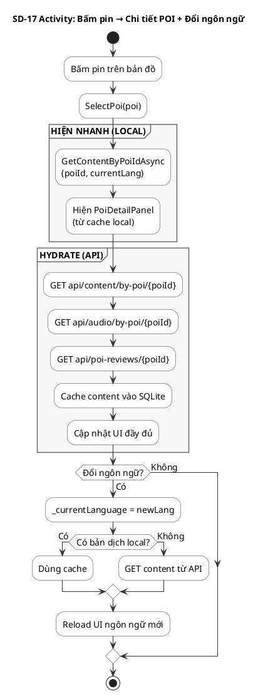

---
## SD-18 (NEW) — Admin Duyệt POI Submission (Create/Update/Delete)
**Mô tả:** Admin vào AdminPoiRegistrations/Pending → xem yêu cầu từ Owner → xem diff → Approve/Reject. Approve create → tạo POI thật + Content. Approve update → sửa POI. Approve delete → xóa POI.

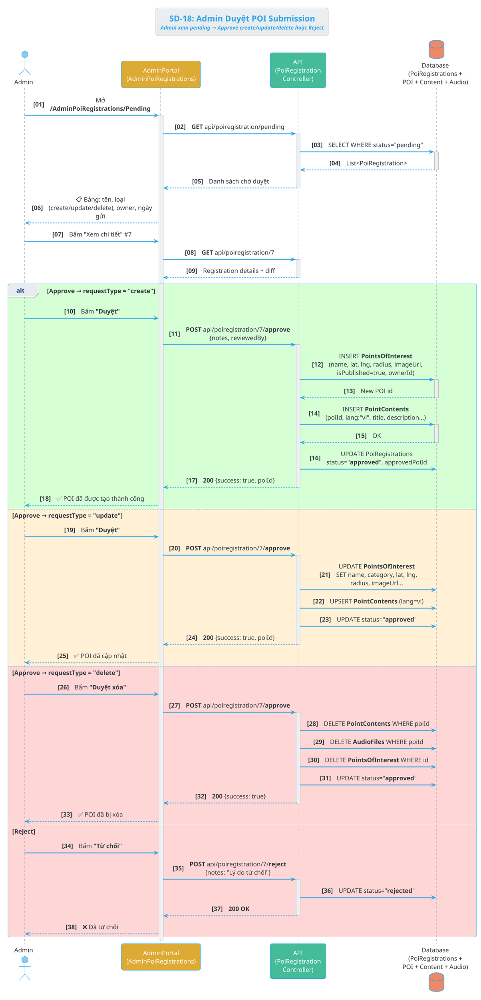

### Activity Diagram — SD-18

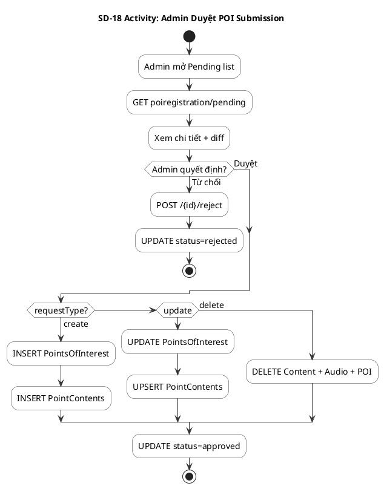

---
## SD-19 (NEW) — Realtime Sync SignalR
**Mô tả:** API Controllers broadcast events qua SyncHub → Mobile SignalRSyncService nhận → RealtimeSyncManager cập nhật SQLite → MapPage re-render. Admin JS nhận TraceLogged → reload KPI.

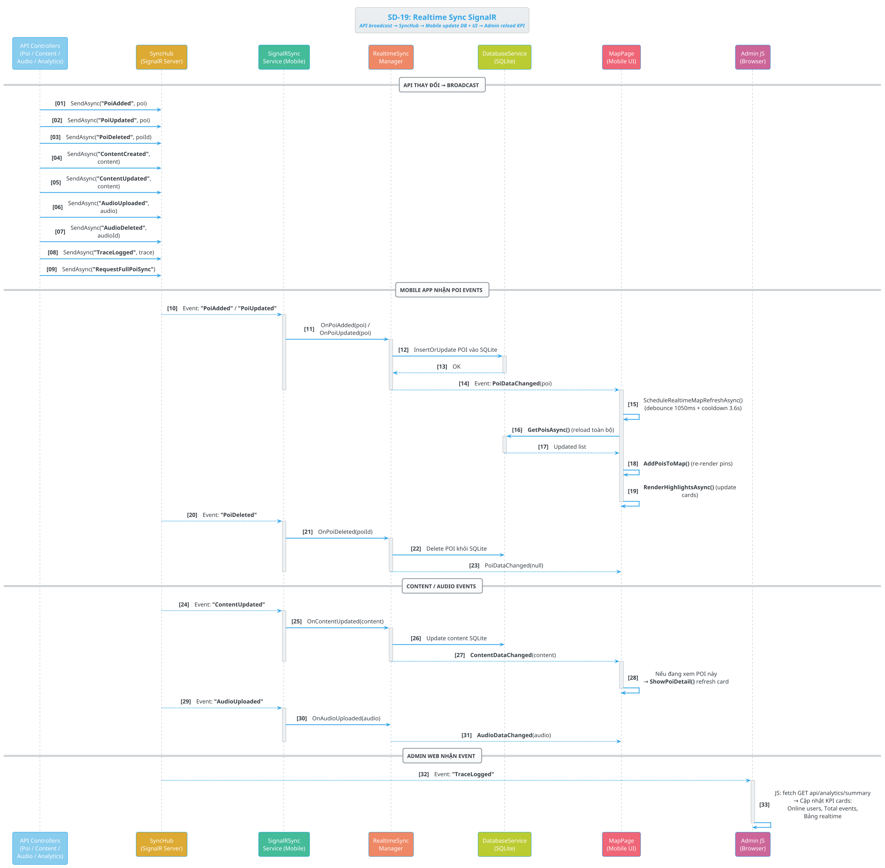

### Activity Diagram — SD-19

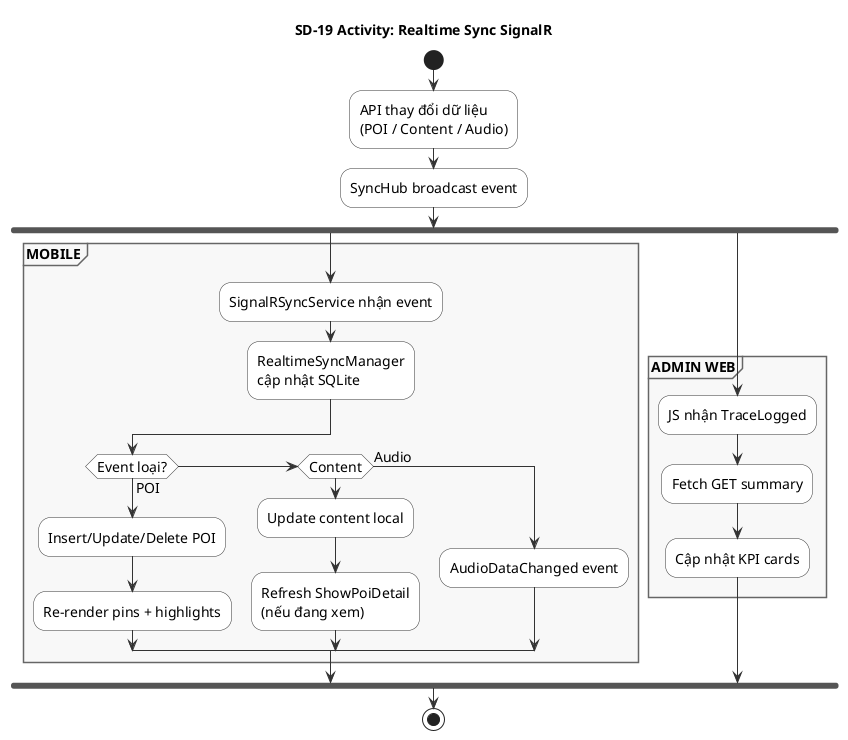

---
## SD-20 (NEW) — GPS Tracking → Admin Route Map
**Mô tả:** LocationPollingService gửi poi_heartbeat mỗi lần GPS → TraceLogs lưu lat/lng. Admin vào AdminRouteMap → API group by deviceId → polylines → Leaflet vẽ tuyến di chuyển.

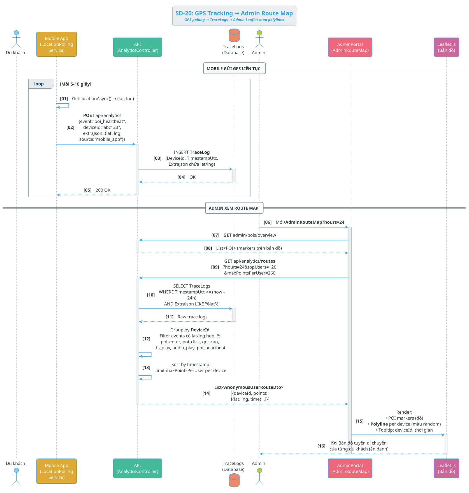

### Activity Diagram — SD-20

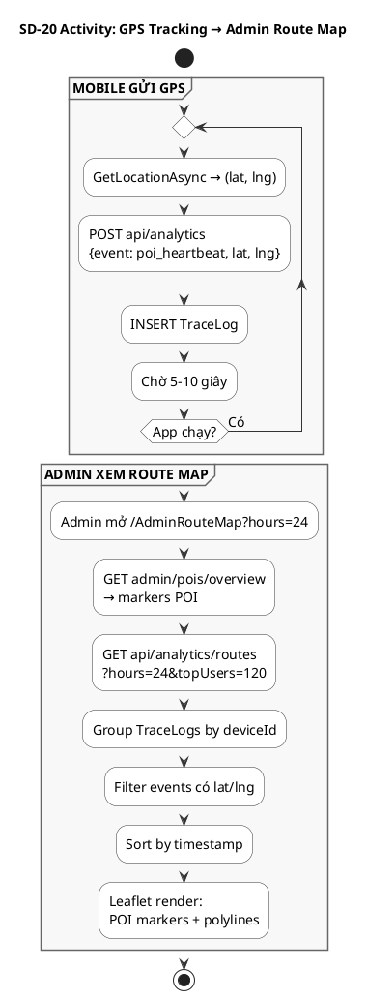

---
## SD-21 (NEW) — Lưu / Chia sẻ / Dẫn đường POI
**Mô tả:** Du khách bấm Lưu → toggle IsSaved trong SQLite local. Chia sẻ → Share API hệ thống. Dẫn đường → mở Google Maps/Apple Maps/Web fallback.

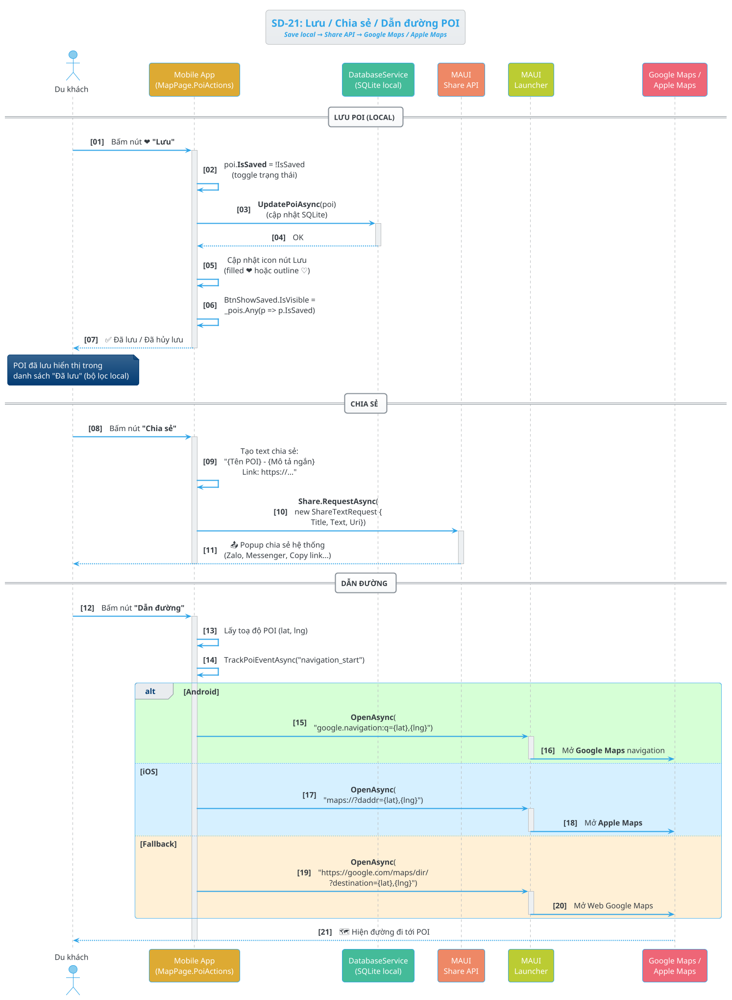

### Activity Diagram — SD-21

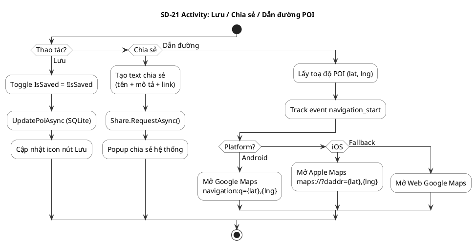
